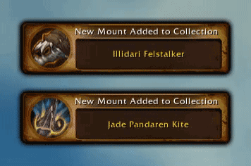

## v8.0.0.1

Update for Battle for Azeroth - Declare your Allegiance
                (Inspector Gadgetzan remains neutral in this conflict)

### Bug fixes

	* Fixed the PlaySound errors introduced in 7.3.5
	* Update call to UnitBuff to fix the Mount Inspector
	* Deal with some embedded library update issues
	* Resolve some FrameXML warnings

## v7.1.0.1

Updated for 7.1

## v7.0.3.8

### Options

More options have been added to the interface options panel where you can have more control over what messages you see and share.  If you're in a large guild, it might get busy seeing everyone's new transmog all the time (if they are also using the addon) so you can turn that off now.  Also, if you don't want to share your new appearances with them, you can control that as well.

Additionally as more addons catch-up and add the feature of printing out new appearances to chat, you can now disable the message from this addon to eliminate duplicates.

## v7.0.3.7

### Undress First

When you use the 'try on' button, it will now first Undress your model.
That way if for example you had a tabard on, but the person you're
basing your outfit on doesn't, it won't continue to show your tabard.

Also, all the dressing rooms now have an 'Undress' button.  This is there
if you have ever tried to look at a chest piece but couldn't because you
had a tabard on.  Or couldn't see your new boots because of your robe.
Or maybe bracers will matter the look of now if your gloves weren't
covering them up ;-)

### Mount Improvements

Pop-up Alert when you learn a new mount.  Ding!  

Instead of "not mounted" message coming up when looking at legacy mounts
(like the Ancient Frostsaber or Black Proto-Drake) or class mounts (like
the Charger or Felsteed) a popup dialog with some details will be given
instead.

Please report any mounts which are not caught by this update but I think
this will handle them.

## v7.0.3.6

Use an 'Alert Frame' to notify about new transmog appearances instead of just chat frame
Make the removal message less definitive to handle false positives better

## v7.0.3.5

### CanIMogIt Integration

The great addon CanIMogIt has been integrated as an optional dependency into Inspector Gadgetzan.  The wardrobe appearances tab will now give additional functionality with it's 'try on' feature using CanIMogIt information.

You can choose to try on all the items that are wearable by you in the other person's appearance, or choose to see what you'd look like wearing all the appearances they are using that you have unlocked, regardless if you can wear them on your current character or not.

Items that you know, or can learn, can be more obviously clicked on to launch the Wardrobe Collection as well.

## v7.0.3.4

### 'MogLog' Know when you unlock *any* transmogrification appearance, not just the epic ones, and tell your friends.

* Report on new appearances
* Use "Inspector Gadgetzan" chat frame if one exists
* Addon name not show in special chat
* Share automatically new appearances with party
* tweaking new appearances messages

## v7.0.3.3

### LDB & Minimap, Interface Options Panel Added

Using a bunch of Ace3 libraries the addon now has a minimap & LDB access to it's commands, as well as an Interface Options panel where you can turn on or off the minimap, and re-enable the 'pickup' mount ability on report.

Bug fixed when launching wardrobe collection as well.

## v7.0.3.2
 	fix hardcoded name
	Bugfix: Ctrl-Click and Quality Color border
	performance tweaks with upvalues and locals
	/ig inspect works most of the time now
	
## v7.0.3.1
	Initial release