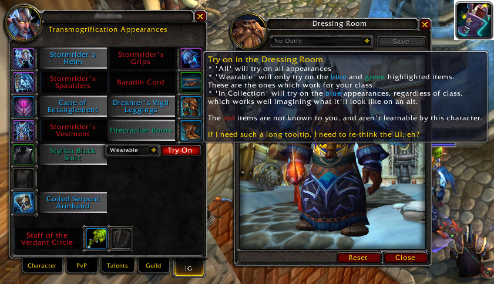
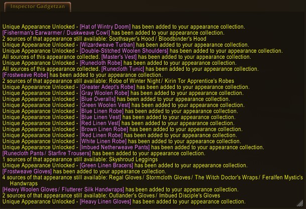

# InspectorGadgetzan

Track appearances as they unlock, inspect another's wardrobe appearances & current mount...  
What else is in his hat?

Know when you unlock *any* transmogrification appearance, not just the epic ones, and tell your friends.  
Take the hassle out of inspecting someone's **transmog**!  
Quickly know (and clone) what **mount** someone is using!  
*Go Go Inspector Gadgetzan!*  

## Overview

With Inspector Gadgetzan, when you inspect another player you get a new tab along the bottom: IG.  Viewing this tab will show you all the appearances that person is using for their current look.  From here you can control-click the items to see how it would look on you, you can look at their tooltips to get extra information (typically from other addons), and you can click its name to view that appearance in the wardrobe collection.

Additionally if the person you are inspecting is mounted, it will show you the name of their current mount, and give you a button to see that mount in the mount journal. 

New in v7.0.3.4 is the **"MogLog"**.  Have you unlocked an epic item and seen the message appear and wonder why that doesn't happen for every appearance?  Well the Inspector was on the case and now it does!  In addition, it will share with your guildies and party members who also have the addon.  Celebrate those unique drops, and keep hunting for additional sources of the same look to complete your collection.  

To get the most out of the MogLog atm, create a new Chat Window (right click on "General" -> New Chat Window) and name it "Inspector Gadgetzan".  That way, all your collections will be in one spot, and not mixed up with all the other stuff happening.  I also choose settings of the new tab and turn off the other chat fields.  This configuration may change in a future release.

Be sure you have your guildies to get the addon as well so they'll see your unlocks and you can see theirs.

## Slash commands & LDB commands

Inspector Gadgetzan gives you a few slash commands to use as well to help with your macros etc. and these functions are available via the minimap icon, and an LDB interface

* `/ig mount`  - this will report to you the current target's mount both in chat and pop the mount journal for that mount
* `/ig mount clone` - this is a fun quick gadget that lets you mount the same mount as your target (if you have it of course)
* `/ig inspect` - inspect the target and jump to the Inspector Gadgetzan tab directly
* `/ig options` - opens the interface options screen

## Development
### Where to find the AddOn

* [https://github.com/ChrisNolan/InspectorGadgetzan](https://github.com/ChrisNolan/InspectorGadgetzan) - Main development site
* [https://mods.curse.com/addons/wow/inspectorgadgetzan](https://mods.curse.com/addons/wow/inspectorgadgetzan)
* [http://www.wowinterface.com/downloads/info24082-InspectorGadgetzan.html](http://www.wowinterface.com/downloads/info24082-InspectorGadgetzan.html)

### Known Issues

* no localization yet

A gadget to improve access to information about players you encounter in World of Warcraft; such as what they are wearing, or which mount they are on written by Hiketeia of Emerald Dream-US.

### Contributors

* VincentSDSH - 2016-07 initial LDB&Minimap code + first fan!
